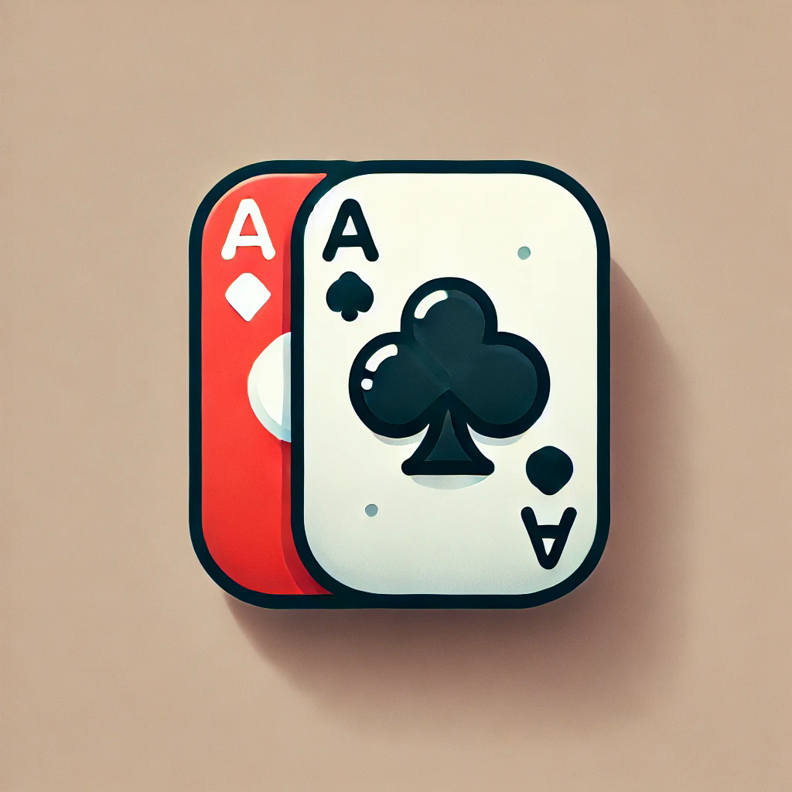

# Lupfen & Schafkopfen App



## Über die App

Dies ist eine mobile App, die die Kartenspiele **Lupfen** und **Schafkopfen** beinhaltet. Die App wurde mit Flutter erstellt und ermöglicht es Spielern, die Regeln beider Spiele zu erkunden und sie direkt auf ihrem Gerät zu spielen.

### Spielregeln

#### Lupfen
Lupfen ist ein Kartenspiel für 3 bis 5 Spieler. Es wird mit einem Deck aus 20 Karten gespielt, bestehend aus den Farben Eicheln, Rosen, Schilden und Schellen. Jeder Spieler erhält drei Karten. Eine der Karten wird als Trumpffarbe bestimmt, und die Spieler versuchen, Stiche zu gewinnen. Der Spieler mit den meisten gewonnenen Stichen erhält den Pot. Zu Beginn einer Runde kann jeder Spieler entscheiden, ob er „lupft“ (mitspielt) oder nicht.

#### Schafkopfen
Schafkopfen ist ein beliebtes bayerisches Kartenspiel für 4 Spieler. Jeder Spieler erhält acht Karten. Die Spieler bilden Paare und versuchen, möglichst viele Stiche zu gewinnen, indem sie Karten derselben Farbe oder Trumpffarbe spielen. Die Karten haben feste Punktwerte, und das Team mit den meisten Punkten gewinnt die Runde.

## Installation und Start der App

### Voraussetzungen
- [Flutter SDK](https://flutter.dev/docs/get-started/install) installiert
- Ein Android- oder iOS-Gerät (oder Emulator), auf dem die App ausgeführt werden kann

### App ausführen
1. **Repository klonen**:
   ```bash
   git clone https://github.com/Seakuh/LupfenUndSchafkopf
   cd https://github.com/Seakuh/LupfenUndSchafkopf
   ```

2. **Abhängigkeiten installieren**:
   ```bash
   flutter pub get
   ```

3. **App starten**:
   - Für Android:
     ```bash
     flutter run
     ```
   - Für iOS:
     ```bash
     flutter run -d ios
     ```

4. **App im Browser testen** (optional):
   ```bash
   flutter run -d chrome
   ```

Die App sollte nun auf deinem Gerät oder Emulator gestartet sein. Du kannst zwischen den Spielen Lupfen und Schafkopfen wählen und die jeweiligen Spielregeln direkt in der App erleben.